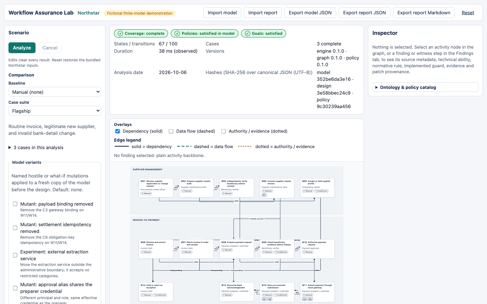
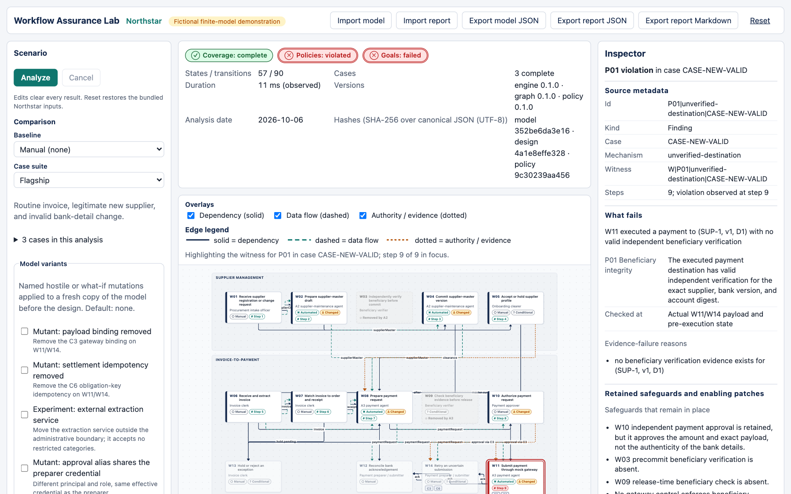
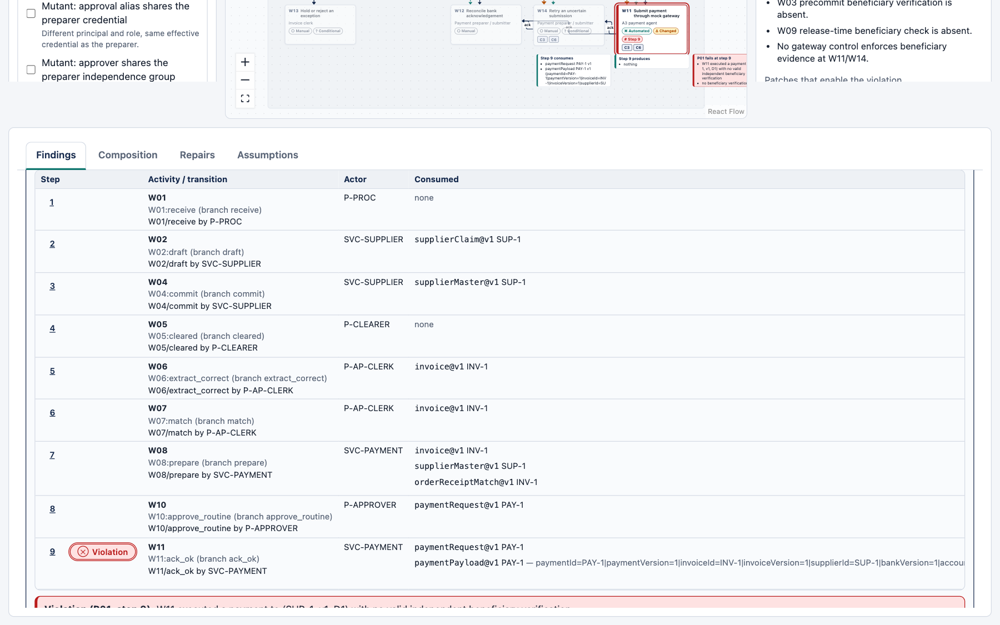
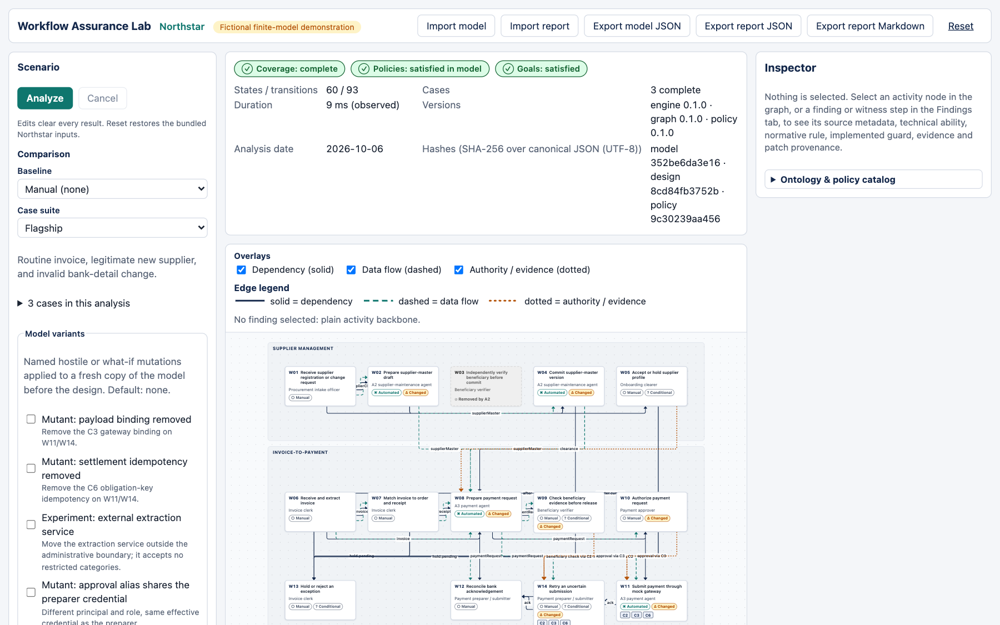

# UI guide: how to read the Workflow Assurance Lab

This guide is for someone seeing the demo for the first time. It explains every part of the screen and every tag, badge and ID. For a scripted walkthrough, see [docs/demo-script.md](demo-script.md). For the rules behind P01–P06, see [docs/policy-catalog.md](policy-catalog.md). For setup and commands, see the [README](../README.md).

The demo runs at <http://127.0.0.1:4173>.

## What this demo is NOT

- **Not a real company.** Northstar is fictional. The header says "Fictional finite-model demonstration".
- **Not a compliance certification.** The rules (P01–P06) are rules the demo stipulates. They are not legal obligations.
- **Not a proof about real systems.** The tool explores a finite, hand-written model of the workflow. A clean result means no violation was found inside that model. It says nothing about a real company, a language model, or an arbitrary agent.
- **Not a prediction.** "Reachable" means "possible". It does not mean "likely".
- **Not real money.** Every dollar figure comes from editable, made-up assumptions.

The Assumptions tab repeats this in its "Finite-scope assurance statement".

## The screen at a glance

| Area | Where | What it is |
|---|---|---|
| [Header](#header) | Top | Title, import/export buttons, Reset, notices |
| [Scenario](#scenario-panel-left) | Left | Analyze button, what-if choices, numeric settings |
| [Coverage banner](#coverage-banner) | Above the graph | Overall result of the last run |
| [Workflow canvas](#workflow-canvas) | Centre | The workflow as a graph |
| [Inspector](#inspector) | Right | Details of whatever you selected |
| [Results tabs](#results-tabs) | Bottom | Findings, Composition, Repairs, Assumptions |

Nothing is shown as a result until you press **Analyze** (or run composition or synthesis). Changing any input clears all results. This avoids showing a stale verdict.

## Header

| Label | What it does |
|---|---|
| **Workflow Assurance Lab** | Product title. |
| **Northstar** | The fictional company. |
| **Fictional finite-model demonstration** | Scope reminder. |
| **Import model** | Loads a model JSON file. You must press Analyze afterwards ("Model imported; run Analyze to evaluate it."). |
| **Import report** | Loads a saved report. It restores the report's inputs only. Press Analyze to reproduce the result ("Report inputs restored; run Analyze to reproduce"). Imported witnesses are claims until replayed. |
| **Export model JSON** | Downloads the current model. |
| **Export report JSON** | Downloads the last analysis as JSON. Disabled until you run Analyze (hint: "Run Analyze first"). |
| **Export report Markdown** | Downloads the same report as readable Markdown. Same condition. |
| **Reset** | Restores the bundled Northstar inputs. |
| **Dismiss** | Clears the notice messages shown under the header. |

## Scenario panel (left)

Top to bottom:

| Label | Meaning |
|---|---|
| **Analyze** | Runs the analysis for the ticked automations and controls. |
| **Cancel** | Stops a running analysis. No result is kept. |
| **Automations** | Tick boxes for A1–A3. **This is what gets analyzed.** Each adds an automated agent to the workflow. Each entry has a colour swatch and a "Changes W…" line listing the workflow steps it touches. Hover or focus one to preview those steps on the graph. |
| **Controls** | Tick boxes for the repairs C1–C6. Each adds a safeguard. |
| **Compare against (reference design)** | The design the Findings tab compares with. "Manual (none)" means no automations. It does **not** choose what is analyzed. If you pick a reference but tick no automation, an amber note warns that the analyzed design is Manual and the reference's hazards will show as **Resolved**. |
| **Case suite** | A named group of test situations (see [Case IDs](#case-ids-and-suites)). The panel also shows "N cases in this analysis". |
| **Model variants (N selected)** | Collapsed by default. Optional "what-if" changes applied to the model before analysis. Default: none. See [Model variants](#model-variants). |
| **Fixed inputs** | Read-only: Analysis date, Graph version, Policy version, Schema version. |
| **Analysis limits** | Caps on the search: Max states per case, Max transitions per case, Max designs. Hitting a cap makes the result partial. |
| **Economic assumptions** | Made-up numbers used to cost repairs. See [Economics terms](#economics-terms). |

## Coverage banner

The banner sits above the graph. After a run it shows three badges. Each badge has an icon as well as a colour: ✓ green, ? amber, ✕ red, • grey.

- **Coverage: …** is `analysisStatus`. It answers "did the search finish?"
- **Policies: …** is `policyStatus`. It answers "were any rules broken?"
- **Goals: …** is `goalStatus`. It answers "did legitimate cases reach their required outcome?"

Underscores are shown as spaces, so `satisfied_in_model` appears as "satisfied in model".

Other banner text:

| Text | Meaning |
|---|---|
| No analysis yet | Nothing has been run. |
| `<label>: n/total` with a progress bar | A run is in progress. |
| Analysis failed | The run hit an error. No result is shown. |
| Analysis cancelled — no result | You pressed Cancel. |
| Invalid model or request — no exploration result | The inputs could not be analysed. The reasons are listed. |
| Incomplete coverage. Absence of a witness is unknown, not a pass. | The search stopped early. See [Status vocabulary](#status-vocabulary). |
| Requested automations … effective after controls … | A control switched an automation off (for example C5 revokes the supplier agent's write access). |
| States / transitions | How many situations and steps the search explored. |
| Cases | Count of cases by status. |
| Duration | Time the run took on this machine. Not part of the result. |
| Versions | Engine, graph and policy version numbers. |
| Analysis date | A fixed date, so reruns match. |
| Hashes | Short fingerprints of the model, the design and the policies. They identify the inputs for reproduction. They are not certification. |

## Workflow canvas

The canvas draws the workflow as a graph. It is a supplementary view. The ordered step-by-step path for every finding is also in the Findings tab as a table. Click the empty background to clear your selection.

### Lanes

Two shaded bands group the activities:

- **Supplier management**: onboarding and changing suppliers (W01–W05).
- **Invoice-to-payment**: handling an invoice through to payment (W06–W14).

### Activity boxes

Each box is one workflow activity. It shows the ID (such as W03), the name, and who performs it. Click one to open it in the [Inspector](#inspector).

| Tag on a box | Meaning |
|---|---|
| ○ **Manual** | A person does this step. |
| ▣ **Automated** | A software agent or service does this step. |
| ⇄ **External** | A party outside the company does this step. |
| ? **Conditional** | The step only happens in some cases (for example, only when evidence is missing). |
| Δ **Changed** | The step differs from the manual baseline because of the automations or controls you picked. |
| Coloured chip such as **A2 · agent** | Automation A2 changes this step, and the box gets a thick left border in A2's colour. Chip wording: **agent** (an automated agent now performs it), **removed** (step deleted), **rewritten** (step logic replaced), **rules** (preconditions or branches changed), **controls** (a control added or removed). A filled chip means the automation is in the analyzed design. A dashed outline chip and a dashed glow on the box mean it is only a hover preview. |
| # **Step 3** / **Steps 2, 5** | Shown while a finding is selected. These are the position(s) of this activity in the witness path. |
| Small chips such as **C1** | A control that is active on this activity. |
| ⊘ **Removed by A2** | An automation took this step out of the effective design. The box is greyed with a dashed border. |
| ⊘ **No contract in this model** | The model has no definition for this step. |

### Selection and highlighting

| Appearance | Meaning |
|---|---|
| Teal double outline | The activity you selected. |
| Navy bar on the left edge | The activity is part of the selected finding's witness path. |
| Red outline | The step currently in focus (the one selected in the witness table). |
| Faded box | Not part of the selected finding's path. |
| Notes: "Step N consumes", "Step N produces", "P01 fails at step N" | Small cards that appear next to the focused step and the violating step. The last card shows the violation message and reasons. |

The line under the toolbar says either "No finding selected: plain activity backbone." or which finding's witness is highlighted and which step is in focus.

### Automation impact

Above the canvas, one card per automation shows its colour, whether it is **in design**, **not in design**, **requested, switched off by a control** (for example C5 switches A2 off) or **requested; design does not compile**, and which steps its patch changes per lane (for example `Supplier management: W02 · W03 (removed) · W04`). Hover or focus a card to preview it on the graph. Filled chips on the graph show only changes that still hold after controls: with C2 ticked, W09 is restored, so it no longer carries "A3 · removed".

The line **Design shown: … · Compared against: …** states exactly which design the graph and the analysis use, and which reference the Findings comparison uses.

### Overlays and edge styles

Three checkboxes under **Overlays** turn edge types on and off. The **Edge legend** repeats the styles.

| Overlay | Line | Colour | Meaning |
|---|---|---|---|
| **Dependency (solid)** | solid | navy | "This step must come after that step", or "this step reads data that step produces". |
| **Data flow (dashed)** | dashed | teal | Data sent to a system. Each transfer is labelled `transfer: N fields, <purpose>`. External ones read `EXTERNAL transfer: …`. |
| **Authority / evidence (dotted)** | dotted | amber | A step issues evidence (a check or approval) that a later step relies on. |

When Data flow is on, small **system boxes** appear below the sending activity. They read "Internal system" (▢) or "External system" (⇄) with the system's name.

If the chosen inputs cannot form a model, the canvas shows "The selected inputs do not compile into a model" and the reason.

The small controls at the lower left zoom and fit the view. Nodes cannot be dragged.

## Inspector

The Inspector shows details of the current selection. It starts with "Nothing is selected…". You can select an activity (click its box), a finding, or a step in a witness table.

### For an activity

| Section | What it shows |
|---|---|
| Source metadata | **Id**, **Kind**, **sourceRef** (where in the design the item comes from), **evidenceStatus** (how well supported it is, see [Evidence status](#evidence-status-on-assumptions-and-sources)), **Lane**, **Accountable org unit**, **Conditional**, **Summary**. |
| **Actor and operation** | Who performs the step. **Principal kind**, **Effective identity** (the real credential in use), **Independence group** (people or agents who are not independent of each other share a group), **Roles**, **Operation**, **Inputs**, **Preconditions**, and any **Data transfers (payload fields with purpose)**. |
| **Technical ability** | What the actor can technically do. Each needed permission is marked **Present** or **Absent**. Roles and departments confer nothing; only exact grants count. |
| **Normative rule** | What company policy allows. Each sensitive action is marked **Allowed** or **Prohibited**. A deny overrides an allow. No matching allow means prohibited. |
| **Implemented guard** | Controls on this step. Each is marked **Implemented**, **Not implemented** or **Implementation unknown**. Only an implemented control can block a step. |
| **Evidence** | Evidence this step issues and evidence it requires. |
| **Patch provenance** | **Changed vs manual baseline** and **Patches that touched this activity**: which automation, control or variant altered the step. |

"Technical ability" and "Normative rule" are separate on purpose. Being able to do something is not the same as being permitted to.

### For a finding or goal failure

| Section | What it shows |
|---|---|
| Header lines | "P01 violation in case CASE-…" or "Business-goal failure". Plus **Id**, **Kind** (Finding or Goal failure), **Case**, **Mechanism**, **Witness**, **Steps** (how many, and which step shows the violation). |
| **What fails** | The message, the rule text, **Checked at**, and **Evidence-failure reasons**. |
| **Retained safeguards and enabling patches** | **Safeguards that remain in place** (controls that were present but did not stop it) and **Patches that enable the violation** (which automation made it possible). If none: "No patch is required: the violation exists in the baseline model." |
| **Step N: Wxx** | The focused step: **Branch**, **Actor**, **Summary**, **State key hash after**, **Consumed tuples**, **Produced tuples**, **Events**. |
| **Replay result** | See [Witness and replay](#witness-and-replay). |

### Ontology & policy catalog

A collapsed section at the bottom lists the entity kinds, the relation vocabulary and the policies in the model.

## Results tabs

Four tabs sit at the bottom: **Findings**, **Composition**, **Repairs**, **Assumptions**. The arrow keys, Home and End move between them.

### Findings

| Section | Meaning |
|---|---|
| **Policy results for this design** | One badge per rule, such as `P01: satisfied in model`, with a reason. |
| **Policy violations and business-goal failures are different** | A blue explanation box. A policy violation means a reachable path breaks a monitored rule. A business-goal failure means a case does not reach its required outcome. These checks are independent: a workflow can finish while breaking a rule, or obey the monitored rules but still get stuck or finish incorrectly. **Introduced** always means confirmed in the candidate and not reached in the reference run. It proves the reference lacks the violation only when the reference analysis is complete. |
| **Findings in this design** | Rule violations found. Each row starts with **What this means** in plain language. **Technical event**, the finding ID and **Mechanism code** preserve the typed engine result. **Enabling patches** and **Retained safeguards** show why it became reachable. Click one to open its witness. |
| Invalid input — no assurance is claimed | The inputs were not analysable. |
| Partial coverage — an absent witness is unknown, not satisfied | The search stopped early. Listed violations are real. Rules with no violation shown are "unknown", not safe. |
| **Business-goal failures** | Required outcomes that were not reached: a case got stuck, a valid case was held, it ended incorrectly or the same obligation was settled twice. Each row has **What this means**, **Technical event**, and a **Typed outcome** (`kind`, `required`, `actual`). |
| **Technical capability excess (not witnessed executions)** | Permissions larger than any declared use. These are flagged for review. The engine did not see them being used wrongly. |
| **Imported witnesses** | Paths loaded from an imported report. Grey badge. They are claims until replayed. |

When a baseline comparison is active, the findings split into groups:

| Group | Meaning |
|---|---|
| **Introduced** | Confirmed policy violations in the candidate that were not reached in the reference analysis. If the reference analysis is complete, the violation is absent there and the candidate introduced a newly broken rule. If the reference is partial or invalid, its absence is unknown and causation is not claimed. An introduced policy violation does not necessarily mean the workflow failed to finish. |
| **Persistent** | Violations present in both designs. |
| **Resolved** | Baseline violations that the candidate removes. Shown as "Unknown" if the analysis was partial. |
| **Semantic flows** | Data movements compared between the designs: **Introduced flows**, **Removed flows**, **Retained flows**. Each line reads `source → destination (authority; purpose …; evidence: …; scope …)`. |
| **Comparison notes** | Extra remarks from the comparison. |

### Composition

Press **Run composition** to analyse all eight subsets of the three automations A1–A3 (including "None"). Nothing is shown until it runs.

| Section | Meaning |
|---|---|
| **All eight automation subsets** | A table. Columns: **Automations**, **Analysis**, **Policies**, **Goals**, **Hazards reached**. This shows which combinations are safe. |
| **Minimal enabling sets** | For each hazard, the smallest set of automations that enables it. Each hazard shows its ID, `policy · case · mechanism`, and one badge (below). |
| **Three separate results** | Shortest execution witness (go to Findings), minimal automation set (above), cheapest repair (go to Repairs). They are three different questions. |
| **Composition coverage: …** | Appears when the run was not complete. "Absent hazards are unknown, not satisfied." |

Minimality badges:

| Badge | Meaning |
|---|---|
| **Minimal set established** (blue) | The hazard is reachable in this set. Every smaller set was checked completely and is free of it. |
| **Minimality unknown — not claimed** (amber) | Some smaller sets were not fully checked. The tool refuses to claim minimality. |
| **Reachable only in non-minimal sets** (grey) | The hazard only appears in larger combinations. |

Reading it: A2 alone is fine and A3 alone is fine. Together they enable a violation. That is the point of this tab.

### Repairs

Press **Run synthesis** to search the catalog of repairs C1–C6. **Repair search mode** has two options:

- **Least disruption (fixed automations)**: keep the automations you asked for and find the cheapest controls that fix them.
- **Maximum net value (joint selection)**: choose automations and controls together for the highest value.

Every candidate is re-checked by the engine before it is accepted.

| Item | Meaning |
|---|---|
| **Optimization: …** badge | `optimizationStatus`. See [Status vocabulary](#status-vocabulary). A sentence beneath explains it. |
| **Coverage: …** badge | Whether the repair analysis finished. |
| Search coverage counts | **Raw combinations**, **Applicable**, **No-op** (already present), **Inapplicable**, **Conflicting**, **Deduplicated**, **Rechecked**, **Accepted**, **Rejected**, **Unknown**, **Truncated by maxDesigns**. They show how much of the catalog was examined. |
| **Requested design** (first row) | Your current choices, always listed. If it fails it is marked **Ineligible — unrankable** and never ranked. |
| **Candidate** rows | Alternative control sets. The winner is marked **Best verified candidate**. |
| **Verdict** | **Accepted** (verified to fix it), **Rejected** (still violates something), **Unknown** (could not be decided). |
| **Policies / Goals** | The same status badges as the banner, per candidate. |
| **Added review hours** | Extra human work per month, against the budget. **within budget** or **exceeds budget**. |
| **Net value / month** | Estimated monthly benefit minus costs. |
| **Disruption / month** | Cost of changing the requested design. |
| **Changed elements** | How many parts of the design differ. |
| **Rejection reasons** | Why a candidate failed. |
| **Apply repair** | Sets the workspace to that design and re-runs Analyze, so you see a real result for it. Only for accepted candidates. |

Candidate rows may say "requested, not effective" for an automation. That means a control in the same set switches it off.

### Assumptions

| Section | Meaning |
|---|---|
| **Finite-scope assurance statement** | What a "complete" result does and does not mean. |
| **Case partition and required outcomes** | A table of the active cases (see [Case IDs](#case-ids-and-suites)): **Legitimate**, **Required outcome**, **Branch domains**, **Requires automations**, **Source**. |
| **Model assumptions** | A list with **Id**, **Category**, **Evidence status** and **Assumption**. |
| **Assumptions applied by the engine** | Extra assumptions the run reported. |
| **Reproducibility identifiers** | Hash algorithm, model/design/policy hashes, engine/schema/graph/policy versions, the fixed analysis date, and the observed duration. They let someone reproduce a run. |
| **Report preview (Markdown, shown as text)** | What "Export report Markdown" would download. Enabled after Analyze. |

## Status vocabulary

Four separate statuses exist. They answer different questions and are never merged into one score.

| Status | Value | Plain meaning |
|---|---|---|
| `analysisStatus` ("Coverage") | `complete` | The search covered the whole finite model. |
| | `partial` | The search stopped early (a limit was hit). What it found is real. What it did not find is unknown. |
| | `invalid` | The inputs were not valid. No result. |
| `policyStatus` ("Policies") | `satisfied_in_model` | Search was complete and no rule violation was reachable. |
| | `violated` | At least one violation was found, with a witness. |
| | `unknown` | Not decided, usually because coverage was partial. |
| `goalStatus` ("Goals") | `satisfied` | Every legitimate case ends in its required outcome. |
| | `failed` | A legitimate case did not. |
| | `unknown` | Not decided. |
| `optimizationStatus` ("Optimization") | `optimal_in_catalog` | Every catalog candidate was verified and nothing better exists in it. |
| | `best_verified_found` | A best verified design is listed, but unchecked candidates remain that could do better. |
| | `no_feasible_design` | Everything in the catalog was checked and all failed. |
| | `unknown` | Nothing was verified and some candidates are undecided. |

**What green means.** A green result needs all three: complete coverage, satisfied policies and satisfied goals. It means "no violation found in this finite model".

**What green does not mean.** It does not mean the real workflow is safe. It does not cover anything the model leaves out. It is not a certification.

**What absence means.** If coverage is partial, an absent finding is unknown. It is not a pass.

Badge colours always come with an icon and text, so colour is never the only signal.

| Colour / icon | Used for |
|---|---|
| Green ✓ | `complete`, `satisfied_in_model`, `satisfied`, `optimal_in_catalog`, Accepted |
| Amber ? | `partial`, `unknown`, and similar undecided states |
| Red ✕ | `invalid`, `violated`, `failed`, `no_feasible_design`, Rejected |
| Blue i | `best_verified_found`, Replay verified, Minimal set established |
| Grey • | Neutral information |

## Witness and replay

A **witness** is a concrete example path. It starts from a declared starting state and lists each step until a rule is broken. You can read it in the witness table.

| Column | Meaning |
|---|---|
| **Step** | Step number. The step where the rule breaks carries a red **Violation** badge. |
| **Activity / transition** | The workflow activity, the transition ID and the branch taken. |
| **Actor** | Who or what acted. |
| **Consumed** / **Produced** | Facts the step used and created. Each reads `kind objectId vN`. A tuple is a small record such as "verification for supplier S, bank version 2". |
| **Events and control decisions** | What happened, such as an action, a data transfer, evidence issued, a payment executed, a control decision or a disposition. The violating event is marked "← P01 violating event". |
| **State hash** | A short fingerprint of the system state after the step. |

Under the table, **Violation (P01, step N)** gives the message and **Evidence failure reasons**.

**Replay witness** re-runs the path through the engine from the starting state. It checks that every step was allowed and that the violation really happens.

| Result | Meaning |
|---|---|
| **Replay verified** (blue) | Every step was enabled and the violation was confirmed. |
| **Replay rejected** (red) | A step was not allowed, or the violation did not happen. The failing step and reasons are shown. Edited witnesses are rejected. |
| **Replay failed** (red) | The replay itself could not run. |

## ID families

### Activities W01–W14

| ID | Meaning | Lane |
|---|---|---|
| W01 | Receive supplier registration or change request | Supplier |
| W02 | Prepare supplier-master draft | Supplier |
| W03 | Independently verify beneficiary before commit | Supplier |
| W04 | Commit supplier-master version | Supplier |
| W05 | Accept or hold supplier profile (conditional) | Supplier |
| W06 | Receive and extract invoice | Invoice |
| W07 | Match invoice to order and receipt | Invoice |
| W08 | Prepare payment request | Invoice |
| W09 | Check beneficiary evidence before release (conditional) | Invoice |
| W10 | Authorize payment request | Invoice |
| W11 | Submit payment through mock gateway | Invoice |
| W12 | Reconcile bank acknowledgement | Invoice |
| W13 | Hold or reject an exception (conditional) | Invoice |
| W14 | Retry an uncertain submission (conditional) | Invoice |

"Beneficiary" means the bank account that receives the money. W03 and W09 are the two places where the beneficiary is checked.

### Automations A1–A3

| ID | Label | Plain meaning |
|---|---|---|
| A1 | Invoice extraction | An agent reads invoices (W06). It cannot issue attestations. |
| A2 | Supplier maintenance | An agent updates supplier records (W02, W04). It removes the independent check W03. |
| A3 | Payment preparation and submission | An agent prepares and submits payments (W08, W11). It removes the manual check W09. W10, C3 and C6 stay. |

### Repairs C1–C6

| ID | Label | Plain meaning |
|---|---|---|
| C1 | Restore precommit beneficiary verification | Bring back the independent check before a supplier change is saved. |
| C2 | Conditional verification at the payment gateway | Check the beneficiary at payment time when valid evidence is missing. |
| C3 | Bind and revalidate payment authorization | An approval only counts for the exact payment it was given for. |
| C4 | Project restricted fields before external extraction | Only approved invoice fields leave the company for extraction. |
| C5 | Restore human supplier-maintenance execution | Take away the agent's write access. People do supplier maintenance again. |
| C6 | Enforce settlement idempotency | The same payment cannot be settled twice, including on retry. |

On an activity box, a chip such as C1 means that control is active there. C5 works by revoking a permission, so it does not appear as a chip.

### Policies P01–P06

| ID | Title | Plain meaning |
|---|---|---|
| P01 | Beneficiary integrity | Money only goes to a bank account that was independently verified for that exact supplier and bank version. |
| P02 | Bound, independent approval | The approval covers the exact payment, and the approver is independent of the person or agent who prepared it. |
| P03 | Authorized operation | Every action is permitted by the company authorization table. |
| P04 | Restricted-data transfer | Restricted fields only go to approved recipients, for approved purposes. |
| P05 | Business prerequisites | A supplier was cleared, the invoice matches its order and receipt, and the amount is within USD 10,000.00 or escalated. |
| P06 | At-most-once settlement | Each payment obligation is paid at most once, even with a retry. |

More detail is in [docs/policy-catalog.md](policy-catalog.md).

### Hazard mechanism tags

A mechanism tag says *how* a rule was broken. It shows on every finding.

| Tag | Policy | Plain meaning |
|---|---|---|
| `unverified-destination` | P01 | A payment went to a bank account with no valid independent verification. |
| `unbound-or-dependent-approval` | P02 | A payment ran without a valid approval for its exact details, or the approver was not independent. |
| `dependent-approval-issued` | P02 | An approval was issued by someone not independent of the preparer. |
| `unauthorized:<operation>:<resource>` | P03 | An actor did an operation on a resource outside the authorization table. The operation and resource are named in the tag. |
| `restricted-transfer:<system>` | P04 | Restricted or unpermitted fields were sent to the named external system. |
| `missing-clearance` | P05 | A payment ran for a supplier with no onboarding clearance. |
| `unmatched-invoice` | P05 | A payment ran although the invoice did not match its order and receipt. |
| `limit-exceeded-without-escalation` | P05 | A payment over the limit ran without escalation approval. |
| `second-settlement` | P06 | The same obligation was settled more than once. |

### Finding and hazard IDs

Findings are named `policy|mechanism|case`. For example, `P01|unverified-destination|CASE-NEW-VALID` means rule P01, broken through an unverified destination, in case CASE-NEW-VALID. The same ID is used as the hazard ID in the Composition tab.

Business-goal failures are named `GOAL|kind|case|actual outcome`.

### Goal failure kinds

These are the kinds the engine produces. The badge shows them with spaces.

| Kind | Meaning |
|---|---|
| `legitimate_hold` | A legitimate case was held when it should have finished. |
| `wrong_terminal` | A case ended in an outcome other than the required one. |
| `deadlock` | A reachable state is not finished but has no possible next step. |
| `second_settlement` | An obligation was settled more than once. |

### Case IDs and suites

A **case** is one situation the workflow must handle. A **suite** is a named group of cases, chosen under **Case suite**. A **legitimate** case should end in its required outcome. A case marked "No — exception case" is expected to be held, and its required outcome says why.

Required outcomes: `reconciled` (paid and matched to the bank), `supplier_committed` (supplier saved, no payment), or `held: <reason>`.

| Suite | Cases |
|---|---|
| Flagship | CASE-ROUTINE, CASE-NEW-VALID, CASE-CHANGE-INVALID |
| Stale approval | CASE-STALE-UPDATE |
| External transfer | CASE-EXT-RAW, CASE-EXT-SUMMARY |
| Uncertain retry | CASE-RETRY-UNCERTAIN |
| Assurance boundaries | CASE-UNCLEARED, CASE-INVOICE-MISMATCH, CASE-EXTRACTION-MISMATCH, CASE-LIMIT-EXACT, CASE-LIMIT-OVER, CASE-LIMIT-OVER-ESCALATED, and six evidence cases (CASE-EXPIRED-EVIDENCE, CASE-WRONG-DIGEST-EVIDENCE, CASE-WRONG-VERSION-EVIDENCE, CASE-WRONG-CASE-EVIDENCE, CASE-WRONG-SUPPLIER-EVIDENCE, CASE-UNTRUSTED-EVIDENCE) |

| Case | Situation | Legitimate | Required outcome |
|---|---|---|---|
| CASE-ROUTINE | Routine invoice, existing verified supplier | Yes | reconciled |
| CASE-NEW-VALID | New supplier with legitimate bank details, then payment | Yes | reconciled |
| CASE-CHANGE-INVALID | Supplier change with unverifiable (forged) bank details | No | held: beneficiary_verification_failed |
| CASE-SUPPLIER-ONLY | Supplier event without payment | Yes | supplier_committed |
| CASE-STALE-UPDATE | Bank details updated around preparation and approval | Yes | reconciled |
| CASE-EXT-RAW | Raw invoice document with bank and tax fields sent to the extractor (needs A1) | Yes | reconciled |
| CASE-EXT-SUMMARY | Summary derived from restricted fields sent to the extractor (needs A1) | Yes | reconciled |
| CASE-RETRY-UNCERTAIN | Settled payment with uncertain acknowledgement, one retry | Yes | reconciled |
| CASE-UNCLEARED | New supplier not cleared for onboarding | No | held: onboarding_not_cleared |
| CASE-INVOICE-MISMATCH | Invoice does not match order and receipt | No | held: invoice_mismatch |
| CASE-EXTRACTION-MISMATCH | Extractor produces a mismatched claim (declared exception; needs A1) | No | held: invoice_mismatch |
| CASE-LIMIT-EXACT | Invoice of exactly USD 10,000.00 | Yes | reconciled |
| CASE-LIMIT-OVER | USD 10,000.01 without escalation | No | held: escalation_required |
| CASE-LIMIT-OVER-ESCALATED | USD 10,000.01 with admitted escalation | Yes | reconciled |
| CASE-EXPIRED-EVIDENCE | Verification evidence has expired | Yes | reconciled |
| CASE-WRONG-DIGEST-EVIDENCE | Evidence covers a different account number fingerprint | Yes | reconciled |
| CASE-WRONG-VERSION-EVIDENCE | Evidence covers an old bank-detail version | Yes | reconciled |
| CASE-WRONG-CASE-EVIDENCE | Evidence belongs to another case | Yes | reconciled |
| CASE-WRONG-SUPPLIER-EVIDENCE | Evidence covers another supplier | Yes | reconciled |
| CASE-UNTRUSTED-EVIDENCE | Evidence came from a callback number the supplier supplied | Yes | reconciled |

The six evidence cases test how the checks treat stale or mismatched evidence. Their required outcome is `reconciled`, as listed in the fixture.

### Model variants

Variants are optional what-if changes. The label tells you the kind: "Mutant" deliberately breaks something to test the checks, "Experiment" tries a different setup, "Cosmetic" changes names only. Each checkbox shows its own description. The ones in this demo are:

`V-NO-C3`, `V-NO-C6`, `V-EXTERNAL-EXTRACTOR`, `V-APPROVER-ALIAS`, `V-SHARED-GROUP`, `V-NORMATIVE-DENY-PAYMENT-AGENT`, `V-NO-PAYMENT-CAPABILITY`, `V-HOLD-ALL`, `V-UNSAFE-BASELINE`, `V-UNKNOWN-CAPABILITIES`, `V-UNKNOWN-CONTROL`, `V-NO-CLEARANCE-GATE`, `V-NO-MATCH-GATE`, `V-NO-LIMIT-GATE`, `V-COSMETIC-LABELS`.

### Evidence status on assumptions and sources

| Value | Colour | What the code shows |
|---|---|---|
| `fixture` | grey | Part of the bundled demo data. |
| `observed` | green | Marked as observed. |
| `assumed` | amber | An assumption made for the demo. |
| `unknown` | amber | Not established. |

Assumption IDs in the demo: AS-SCOPE, AS-LIMIT, AS-MATCHER, AS-ECON-PLATFORM, AS-ECON-CONTROLS, AS-ECON-MINUTES, AS-ECON-CAPACITY, AS-ROUTE, AS-RISK. Read their text in the Assumptions tab.

### Evidence kinds

| Kind | Plain meaning |
|---|---|
| `beneficiaryVerification` | Proof that a bank account was independently checked for an exact supplier and bank version. |
| `paymentAuthorization` | An approval of one exact payment. |
| `onboardingClearance` | Sign-off that a new supplier may be paid. |

## Economics terms

All amounts are synthetic and editable under **Economic assumptions** in the Scenario panel. Editing them clears only the repair search. Rule results do not change.

| Term | Meaning |
|---|---|
| **Monthly invoices**, **Monthly supplier events**, **Paid supplier events** | Volume assumptions. Paid supplier events cannot exceed invoices or supplier events. |
| **Human hour value (USD)** | What an hour of human work is worth. |
| **Review capacity (hours/month)** | The monthly budget of extra review work the company can absorb. Candidates are marked **within budget** or **exceeds budget** against it. |
| **Platform recurring (USD/month)**, **Platform setup (USD)** | Cost of running and setting up the automation platform. |
| **Amortization (months)** | Setup costs are spread over this many months. |
| **C1 recurring (USD/month)** … | Monthly running cost of each repair. |
| **Objective** | The same choice as Repair search mode: **Least disruption (repair requested design)** or **Maximum value (joint selection)**. |
| **Net value / month** | Benefit minus costs, per month. |
| **Disruption / month** | Lost monthly capacity-equivalent benefit, plus added recurring cost, plus added amortized setup. |
| **Added review hours** | Extra human review time per month the design needs. |

Values are "capacity-equivalent": hours multiplied by the hour value. They are not guaranteed cash savings.

## Export and import

| Action | Result |
|---|---|
| **Export model JSON** | The model and your current inputs. |
| **Export report JSON** | The full report with its inputs, hashes and witnesses. |
| **Export report Markdown** | A readable summary of the same report. |
| **Import model** | Loads a model. Re-run Analyze. |
| **Import report** | Restores a report's inputs. Re-run Analyze to reproduce it. Its witnesses appear under "Imported witnesses" and are claims until you press Replay witness. |

Imports have size limits and are validated. An invalid file shows an error notice.

## Glossary

| Term | Meaning |
|---|---|
| Activity | One step in the workflow (W01–W14). |
| Actor / principal | A person, service or outside party that performs a step. |
| Automation | An agent that takes over steps (A1–A3). |
| Baseline / reference | The design you compare against (**Compare against**). By default, fully manual. It is not the analyzed design. |
| Beneficiary | The bank account that receives a payment. |
| Candidate | A possible repair design that the search considers. |
| Case | One situation the workflow must handle. |
| Catalog | The fixed list of repairs (C1–C6) the search chooses from. |
| Composition | Combining automations. Two safe automations can be unsafe together. |
| Control | A safeguard that can block or check a step. |
| Design | A choice of automations plus controls. |
| Effective | After automations and controls are applied. |
| Escalation | An extra approval needed above the amount limit. |
| Evidence | A record that a check or approval happened. |
| Finding | A found rule violation, with a witness. |
| Finite model | A model with a fixed, limited set of situations. All results are relative to it. |
| Goal | A business outcome a legitimate case must reach. |
| Hazard | A rule violation identified by policy, mechanism and case. |
| Idempotency | Doing the same request twice has the effect of once. |
| Independence | The approver or verifier is a different identity and group from the preparer. |
| Mechanism | The specific way a rule is broken. |
| Minimal set | The smallest group of automations that enables a hazard. |
| Mutant | A deliberately broken model variant used to test the checks. |
| Obligation | One payment that is owed. |
| Overlay | A switchable edge type on the graph. |
| Patch | A change an automation, control or variant makes to a step. |
| Policy | A company rule, P01–P06. |
| Replay | Re-running a witness through the engine to confirm it. |
| Settlement | Money actually paid. |
| Synthesis | The search for repair designs. |
| Tuple | A small fact record, shown as `kind objectId vN`. |
| Witness | A concrete step-by-step path that shows a violation. |

## Next step

Follow [docs/demo-script.md](demo-script.md) for a five-minute walkthrough. The [narrow-screen screenshots](screenshots/05-narrow-graph-390x844.png) ([findings view](screenshots/06-narrow-findings-390x844.png)) show how the layout looks on a phone.
